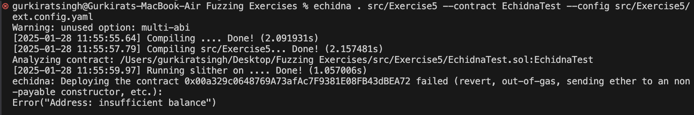

## If you don't have balance in the contract of echifna you'll get below error 

## To solve above error add balance of ether to echdina test file so that it can trasnfer to User and Pool
`balanceContract: 10000000000000000000000`
